# Separable Box-Constrained Sum-Equality QP Layer — Demo (Figures & Interpretation)

This report explains the **figures and printed statistics** produced by `demo_separable_qp_layer.py` (the “demo script”) for a **separable convex QP** with

- a **single sum-equality constraint**: $\sum_i x_i = \xi$
- **box constraints**: $m_i \le x_i \le M_i$
- strictly positive curvature: $\gamma_i > 0$

It is intended to live **in the same folder as the generated `.png` outputs** (e.g. `closed_form_QP_layer/demo_outputs_v2/`), so **all image links below are simple filenames**.

> **Math rendering note (important).**
> Markdown itself does *not* guarantee LaTeX rendering; that depends on the viewer/converter.
> This file uses standard “MathJax/KaTeX style” math:
>
> - inline: `$...$`
> - block: `$$...$$`
>
> If your viewer shows raw LaTeX (common in some IDE previews), the document still includes **plain-text fallbacks**
> right under the key formulas so nothing goes missing in PDFs.

---

## Contents (quick navigation)

1. [Problem statement and “projection” view](#1-problem-statement-and-projection-view)
2. [Closed-form structure, the multiplier $\lambda$, and the “active set”](#2-closed-form-structure-the-multiplier-lambda-and-the-active-set)
3. [What the printed stats mean (and what values you should expect)](#3-what-the-printed-stats-mean-and-what-values-you-should-expect)
4. [Use case A — Simplex-like activation (QP vs softmax)](#4-use-case-a--simplex-like-activation-qp-vs-softmax)
5. [Use case B — k-hot / budgeted gating ($\sum x = k$)](#5-use-case-b--k-hot--budgeted-gating-sum-x--k)
6. [Use case C — Adaptive $\xi$ (learned but always feasible)](#6-use-case-c--adaptive-xi-learned-but-always-feasible)
7. [Use case D — Learnable bounds $m,M$ (unit mode) + toy training](#7-use-case-d--learnable-bounds-mm-unit-mode--toy-training)
8. [Use case E — Non-uniform $\gamma$ (“stiffness” / cost shaping)](#8-use-case-e--non-uniform-gamma-stiffness--cost-shaping)
9. [Use case F — Solve from $\beta$ directly (predefined costs)](#9-use-case-f--solve-from-beta-directly-predefined-costs)
10. [Use case G — Fixed $z$ (deterministic constrained allocation)](#10-use-case-g--fixed-z-deterministic-constrained-allocation)
11. [Geometry demo (N=2): contours + feasible set + solution](#11-geometry-demo-n2-contours--feasible-set--solution)
12. [Troubleshooting: blank plots, missing images, and sanity checks](#12-troubleshooting-blank-plots-missing-images-and-sanity-checks)

---

## 1. Problem statement and “projection” view

For each row (each sample) we solve:

$$
\begin{aligned}
\min_{x\in\mathbb{R}^N}\;& \sum_{i=1}^N \left(\gamma_i x_i^2 + \beta_i x_i\right) \\
\text{s.t.}\;& \sum_{i=1}^N x_i = \xi,\qquad m_i \le x_i \le M_i,\qquad \gamma_i>0.
\end{aligned}
$$

**Plain-text fallback:**

```text
min_x Σ_i (γ_i x_i^2 + β_i x_i)
s.t.  Σ_i x_i = ξ,   m_i ≤ x_i ≤ M_i,   γ_i > 0
```

Ignoring additive constants, this is equivalent to a **weighted Euclidean projection** onto the feasible polytope:

$$
\min_x\; \sum_{i=1}^N \gamma_i\,(x_i - z_i)^2
\quad\text{where}\quad
z_i = -\frac{\beta_i}{2\gamma_i}.
$$

**Plain-text fallback:**

```text
Define z_i := -β_i / (2 γ_i). Then solve
min_x Σ_i γ_i (x_i - z_i)^2
s.t.  Σ_i x_i = ξ,   m_i ≤ x_i ≤ M_i
```

Define the feasible set:

$$
\mathcal{C} \;=\; \left\{x \in \mathbb{R}^N \;:\; \sum_i x_i = \xi,\; m_i\le x_i\le M_i \right\}.
$$

Because $\gamma_i>0$, the objective is **strictly convex**, so the solution $x^*$ is **unique**.

---

## 2. Closed-form structure, the multiplier $\lambda$, and the “active set”

### 2.1 KKT form (the identity the layer implements)

The optimal solution has the form:

$$
x_i^*(\lambda) = \operatorname{clip}\!\left(z_i + \frac{\lambda}{2\gamma_i},\; [m_i,M_i]\right),
$$

where $\operatorname{clip}(u,[m,M]) = \min(\max(u,m),M)$, and the scalar $\lambda$ is chosen so that:

$$
\sum_{i=1}^N x_i^*(\lambda) = \xi.
$$

**Plain-text fallback:**

```text
x_i*(λ) = clip(z_i + λ/(2γ_i), [m_i, M_i])
Choose λ so that Σ_i x_i*(λ) = ξ
```

Define the monotone function:

$$
g(\lambda) = \sum_{i=1}^N \operatorname{clip}\!\left(z_i + \frac{\lambda}{2\gamma_i}, [m_i,M_i]\right).
$$

Then we solve **a 1D root-finding problem**:

$$
g(\lambda) - \xi = 0.
$$

### 2.2 Why the active set exists (and why you don’t need to explicitly enumerate it)

Each coordinate belongs to one of three regimes:

- **lower-active**: $x_i = m_i$
- **upper-active**: $x_i = M_i$
- **free**: $m_i < x_i < M_i$

As $\lambda$ changes, coordinates can move from free to clamped (and vice versa).
The set of free coordinates is the **active set** (in the sense of KKT activity).

**Key point:** you do *not* need to explicitly compute regime breakpoints in code.
Because each clipped term is monotone in $\lambda$, $g(\lambda)$ is monotone, so **bisection** is robust and simple.

### 2.3 How $\lambda$ is computed in the implementation (bracketing + bisection)

A safe bracket comes from the thresholds at which each coordinate would hit a bound:

- to force $x_i=m_i$, we need $z_i + \lambda/(2\gamma_i) \le m_i$
  $\Rightarrow \lambda \le 2\gamma_i (m_i - z_i)$
- to force $x_i=M_i$, we need $z_i + \lambda/(2\gamma_i) \ge M_i$
  $\Rightarrow \lambda \ge 2\gamma_i (M_i - z_i)$

So one valid global bracket is

$$
\lambda_{\min} = \min_i 2\gamma_i(m_i-z_i),\qquad
\lambda_{\max} = \max_i 2\gamma_i(M_i-z_i),
$$

which guarantees $g(\lambda_{\min}) \le \sum_i m_i$ and $g(\lambda_{\max}) \ge \sum_i M_i$.
If $\xi\in[\sum_i m_i,\sum_i M_i]$, the root lies in this bracket.

**Complexity:** $O(B\,N\,T)$ for batch $B$, dim $N$, bisection steps $T$.
In practice, $T \in [30,80]$ is already very accurate.

---

## 3. What the printed stats mean (and what values you should expect)

The demo prints a small set of stats that are meant to be **sanity anchors**.

### 3.1 Always-true feasibility checks

Regardless of the input distribution, the solution must satisfy:

- box feasibility: $m_i \le x_i \le M_i$
- sum feasibility: $\sum_i x_i = \xi$ (up to a tiny numerical tolerance)

So two “should be tiny” numbers are:

- `mean_abs_sum_err`
- `max_abs_sum_err`

If those are not near machine tolerance (e.g. $10^{-6}$–$10^{-9}$ for float32), increase bisection iterations.

### 3.2 Easy reference values for “means”

If a run uses $\xi$ fixed and symmetric dimensions, the **mean entry** has a simple reference:

- **simplex mode** ($\xi=1$, $N=100$): expected `mean_value ≈ 1/N = 0.01`
- **k-hot mode** ($\xi=k$, $N=200$, $k=10$): expected `mean_value ≈ k/N = 0.05`

This is not a probabilistic expectation; it is a deterministic identity:

$\text{mean over entries} = \frac{1}{BN}\sum_{b=1}^B\sum_{i=1}^N x_{b,i}
= \frac{1}{N}\left(\frac{1}{B}\sum_{b=1}^B \xi_b\right).$

### 3.3 Interpreting sparsity

Projection onto a capped simplex commonly yields:

- many **exact zeros**
- a small “support size” per row: $\|x\|_0 = \#\{i: x_i>0\}$

Softmax, by contrast, yields strictly positive outputs, so support size is always $N$.

The demo shows this in multiple ways:

- `mean_L0` / `std_L0`
- histograms of values with log scales
- “sorted profile quantile bands”

---

## 4. Use case A — Simplex-like activation (QP vs softmax)

### 4.1 Setup

- $m=0$, $M=1$
- $\xi=1$
- $\gamma_i \equiv 1$
- input “scores” $z$ are standard normal

The feasible set is a **capped simplex**:
$$
\{x: 0 \le x \le 1,\; \sum_i x_i = 1\}.
$$
For $\xi=1$, the upper bound is typically inactive, so behavior is close to the **classic simplex projection**.

### 4.2 What this layer does vs softmax (mechanically)

- **Softmax:** $x_i = \exp(z_i)/\sum_j \exp(z_j)$
  Smooth, dense, never exactly 0, tail mass everywhere.
- **QP projection:** “shift-and-clip” with a shared $\lambda$, 
  $x = \operatorname{clip}(z + \lambda/2,\,[0,1])$ with $\sum x = 1$.
  Produces exact zeros once the shift makes a coordinate negative.

This is why it is a good **sparsity-inducing alternative** to softmax when you want probability-like outputs but with hard support.

---

### Figure A1 — Linear-scale value histogram (QP vs softmax)

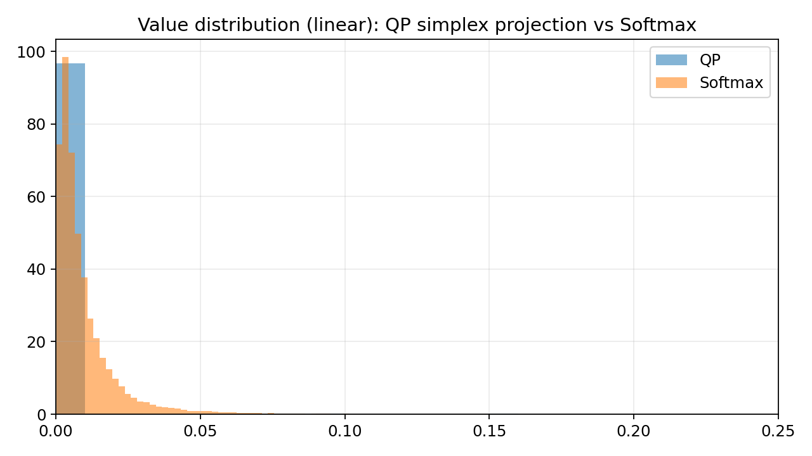

What to look for:

- softmax is concentrated near small positive values, never touching 0
- QP shows a spike at 0 and a wider spread among the nonzeros

### Figure A2 — Log-y histogram for clarity (QP vs softmax)

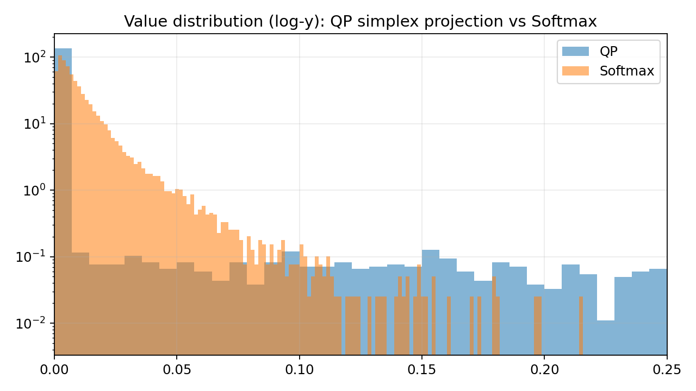

Log-y makes the small tail visible.
Useful when the nonzero distribution spans several decades.

### Figure A3 — log10(value) histogram (QP vs softmax)  --> also need log10 on density

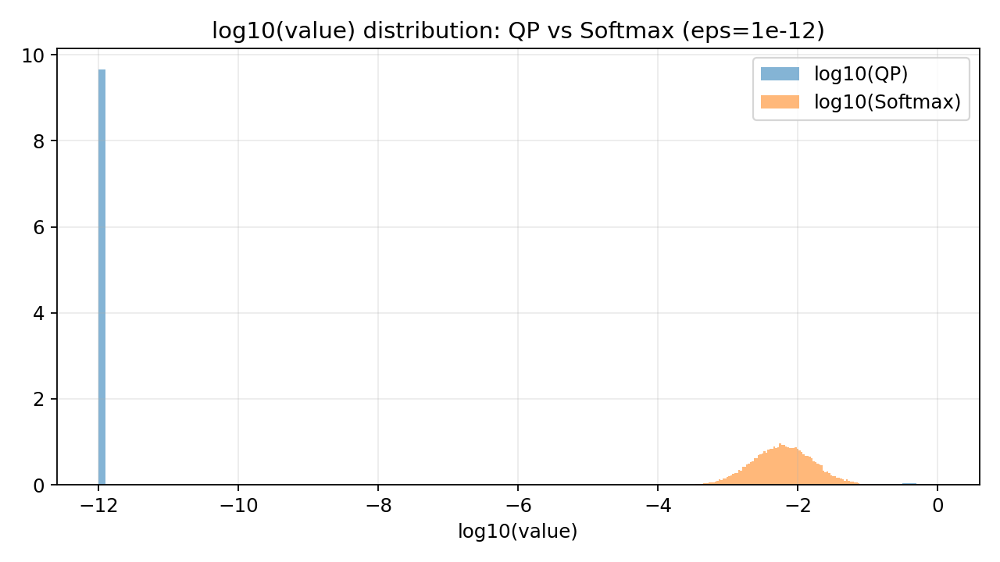

Interpretation:

- a big mass at very negative log10 corresponds to zeros (or values clamped to epsilon before logging)
- the right side shows the distribution of meaningful nonzero entries

### Figure A4 — Sorted profile quantile bands (softmax)

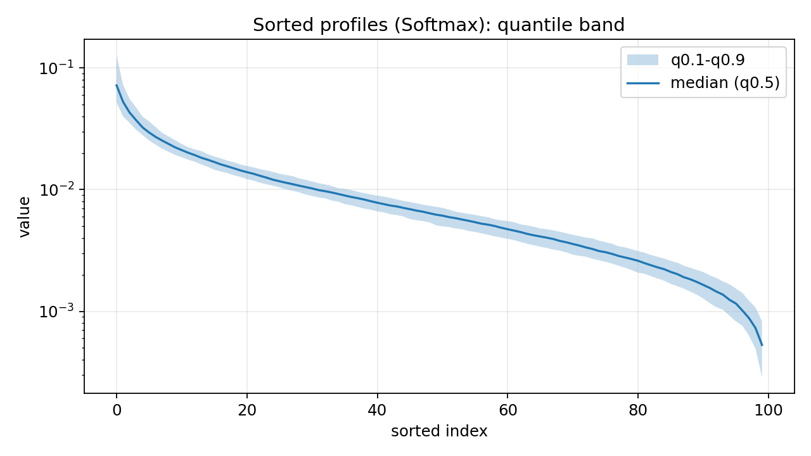

Each row $x_b$ is sorted descending and then we plot a quantile band across rows (e.g. q0.1–q0.9) + median.

What you should see:

- a long tail: even high ranks (e.g. 50–100) have non-trivial mass

### Figure A5 — Sorted profile quantile bands (QP)

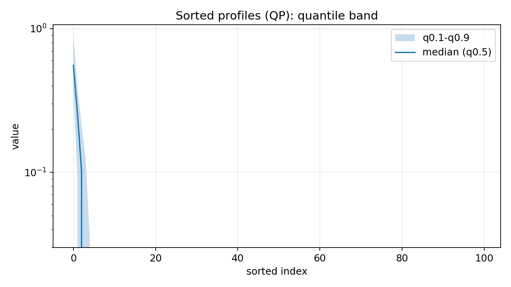

What you should see:

- a steep head (few large entries)
- a sharp drop to exact zeros (support size is small)

This is the “projection signature” and is the main qualitative difference from softmax.

### Figure A6 — Support size distribution (QP)

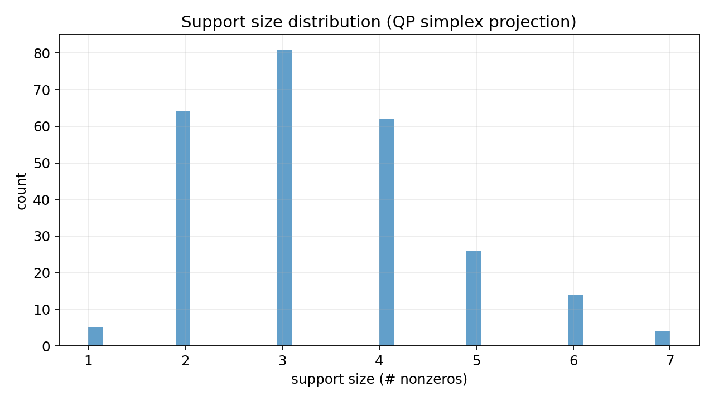

This turns sparsity into an explicit integer statistic.
For random normal $z$, the support size often concentrates in a modest range (not near 1 and not near $N$).

### Figure A7 — Top-k mass curves (QP vs softmax)

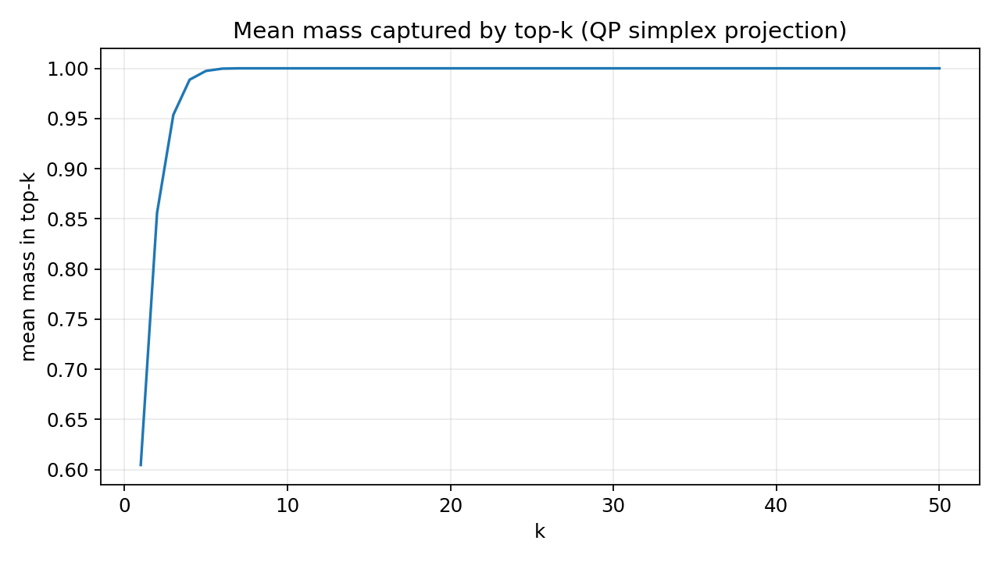

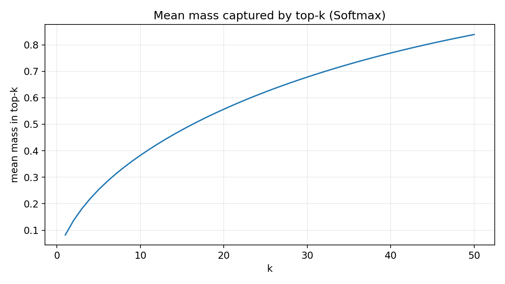

These show how quickly the cumulative mass $\sum_{i\le k} x_{(i)}$ approaches 1 as $k$ grows.

- QP typically concentrates mass faster (higher mass captured by small k)
- softmax spreads mass more widely

### Figure A8 — Accuracy vs high-iteration reference

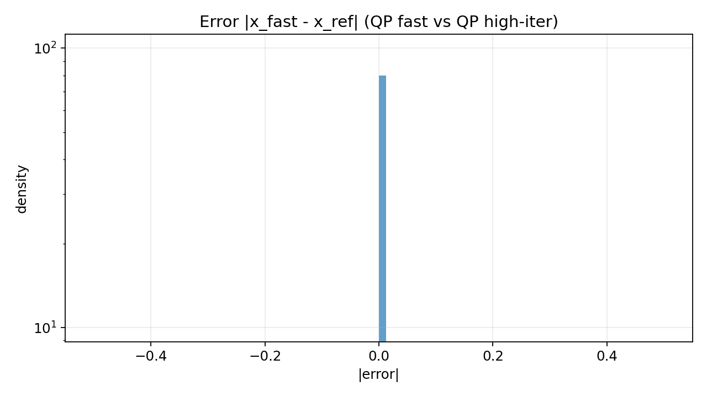

This compares a “fast” bisection count (e.g. 40) to a high-iter reference (e.g. 220).
You want the histogram concentrated near 0.

### Figure A9 — QP vs exact simplex projection reference (sort-based)


This is an extra sanity check: for $(m,M)=(0,1)$, $\xi=1$, $\gamma=1$, the solution should match the classic simplex projection (up to the inactive $x\le1$ cap).

If this error is not tiny, something is wrong in the projection implementation or the reference.

### Figure A10 — Piecewise structure as $\xi$ changes (and free-count changes)

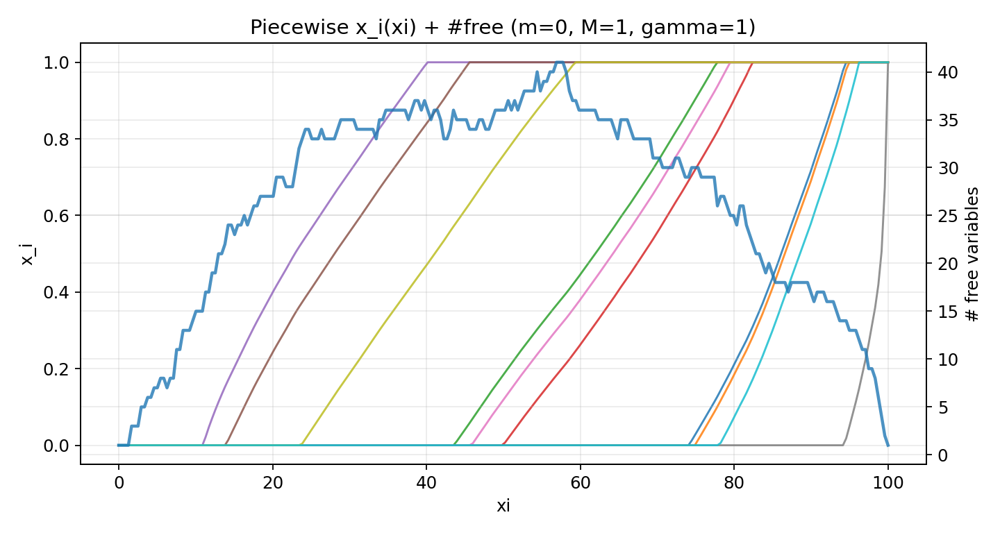

This figure sweeps $\xi$ and plots:

- several coordinates $x_i^*(\xi)$
- the number of “free” coordinates (not clamped)

Interpretation:

- between regime changes, $x^*(\xi)$ is **affine** in $\xi$
- regime changes occur when some coordinate hits 0 or 1 and joins/leaves the active set

This is a visual equivalent of the “breakpoints / regimes” description in the closed-form solution.

---

## 5. Use case B — k-hot / budgeted gating ($\sum x = k$)

### 5.1 Setup

- $m=0$, $M=1$
- $\xi=k$ (demo: $k=10$)
- $\gamma_i \equiv 1$
- $z\sim \mathcal{N}(0,1)$

This is a continuous relaxation of selecting roughly $k$ items (a “budget” spread with per-dimension caps).
Typical ML use: **mixture-of-experts routing**, **feature gating**, **budgeted attention**, **resource allocation**.

### Figure B1 — Value histogram (log-y)

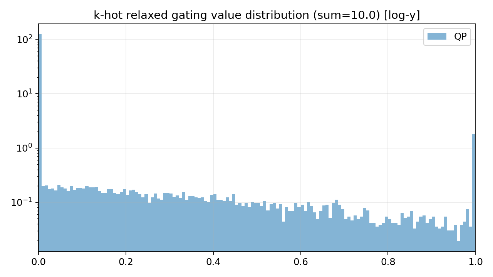

Expected behavior:

- many zeros (inactive experts/features)
- many small positives
- sometimes a nontrivial mass near 1 (if some dimensions saturate)

### Figure B2 — log10(value) histogram

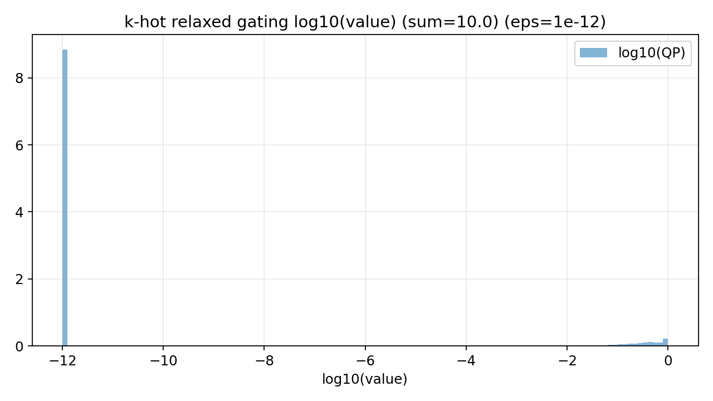

Use this to see the separation between exact zeros and the distribution of positives.

### Figure B3 — Support size distribution

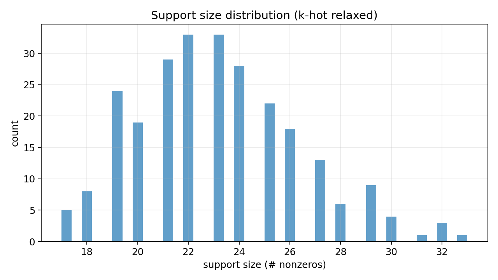

With $\xi=k$ and $x\in[0,1]$, the support size must be at least $\lceil k\rceil$, but can be larger (e.g., many fractional allocations).

### Figure B4 — Mean mass captured by top-k

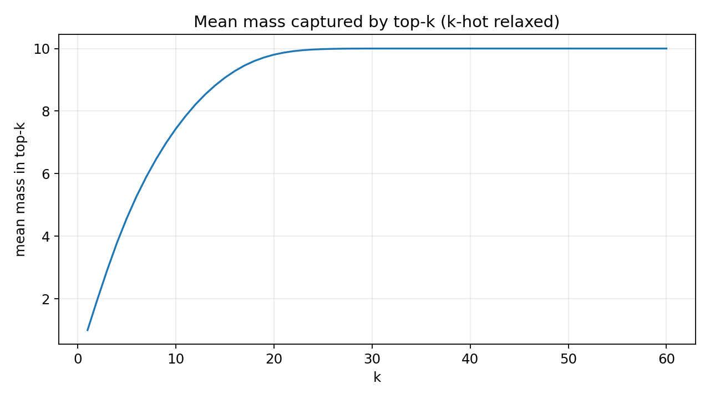

If the curve saturates near 1 quickly, the allocation is concentrated.
If it grows slowly, the solution is spread across many coordinates.

### Figure B5 — Sorted profile quantile band

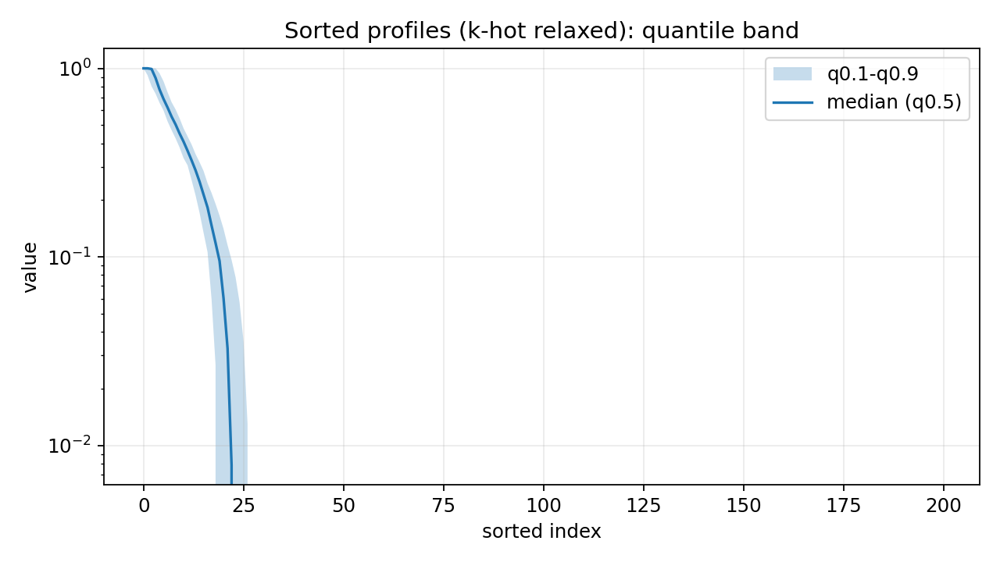

Compare to simplex: the head is broader because there is more mass to distribute.

### Figure B6 — Fast vs high-iter error


Same purpose as in simplex: check bisection accuracy.

---

## 6. Use case C — Adaptive $\xi$ (learned but always feasible)

### 6.1 The idea

Sometimes the “budget” $\xi$ is context-dependent (e.g., allocate more capacity when input is complex).

A safe parameterization that *guarantees feasibility* is:

$$
\xi(t) = \sum_i m_i + \sigma(t)\,\Bigl(\sum_i M_i - \sum_i m_i\Bigr),
$$

so that $\xi(t)\in[\sum m,\sum M]$ for all $t$.

**Plain-text fallback:**

```text
xi(t) = sum(m) + sigmoid(t) * (sum(M) - sum(m))
=> always feasible
```

When $m=0$, $M=1$, this becomes:

$$
\xi(t) = \sigma(t) \, N.
$$

### Figure C1 — $\xi(t)$ curve (with theoretical reference)

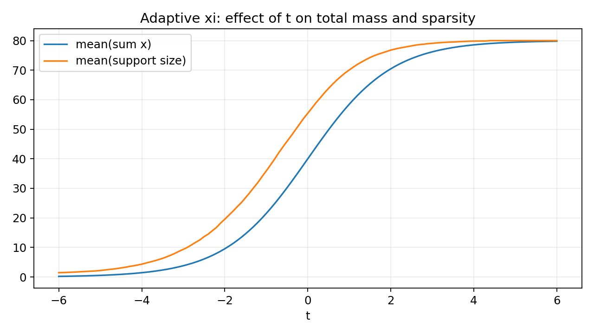

What you should see:

- the curve is sigmoid-shaped
- the “mean(sum x)” matches $\xi(t)$ almost exactly (because the constraint enforces it)

### Figure C2 — Value histogram (log-y)

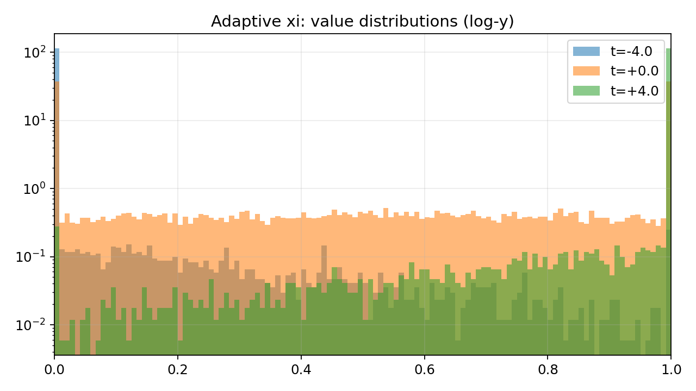

As $\xi$ increases, the mean value increases (since mean is $\xi/N$), and sparsity typically decreases.

---

## 7. Use case D — Learnable bounds $m,M$ (unit mode) + toy training

### 7.1 Why learn bounds?

Learning $m_i$ and $M_i$ lets the model learn the *shape of the feasible polytope*:

- a larger $m_i$: forces a baseline allocation to dimension $i$
- a smaller $M_i$: caps how much dimension $i$ can take
- a very small width $M_i-m_i$: effectively disables that dimension (it becomes almost fixed)

### 7.2 “Unit mode” parameterization (always valid by construction)

A common safe construction is:

$$
m_i = \sigma(a_i),\qquad
M_i = m_i + (1-m_i)\,\sigma(b_i),
$$

which guarantees $0 < m_i < M_i < 1$.

### Figure D1 — Learned $m$ distribution (initial vs final)

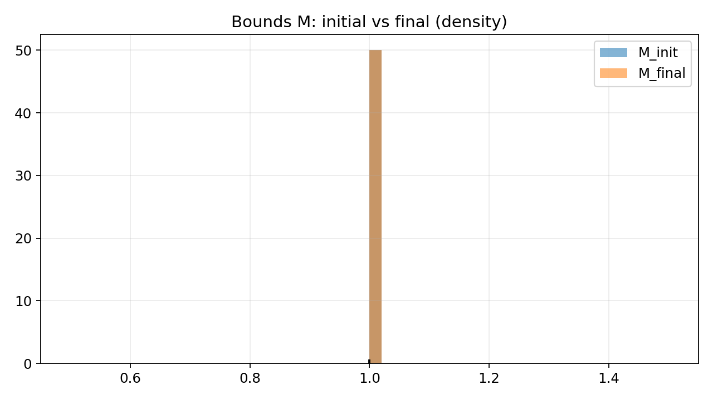

### Figure D2 — Learned $M$ distribution (initial vs final)


> If these histograms look “blank”: it usually means the distribution has **collapsed to a narrow spike** (e.g. almost all values are extremely close to 1),
> and the histogram bins + axis limits hide it. See troubleshooting at the end for a quick fix.

### Figure D3 — Width $M-m$ distribution (log-y)

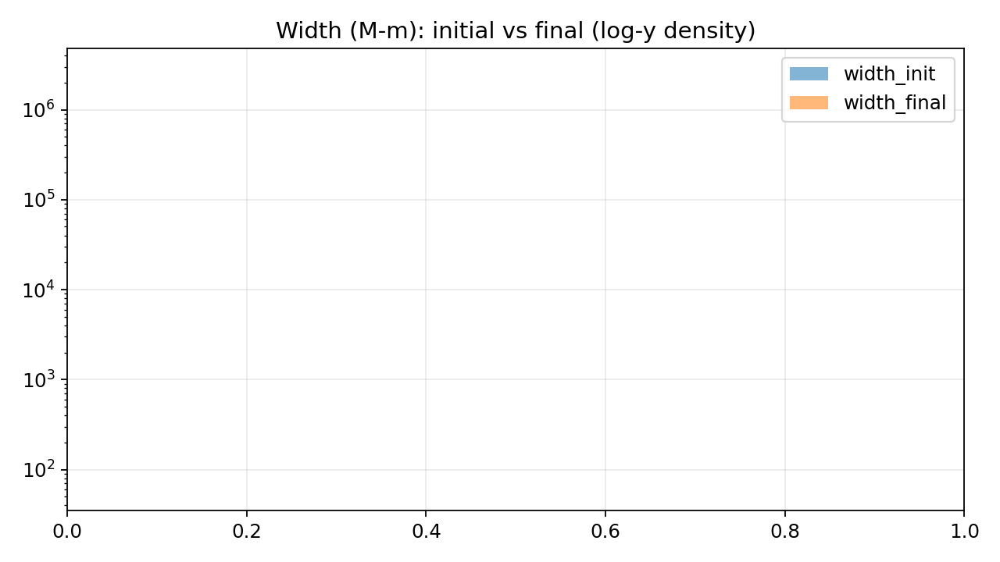

Width is the “degrees of freedom per coordinate.”
Log-y helps when widths cluster near zero (common after training).

### Figure D4 — Toy training loss curve (log-y)

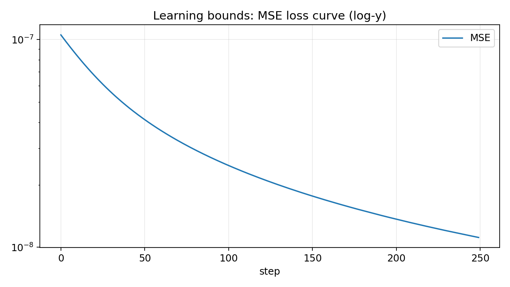

Log-y is useful because this toy objective can reach very small errors quickly.

### Figure D5 — Absolute error distribution (log-y)

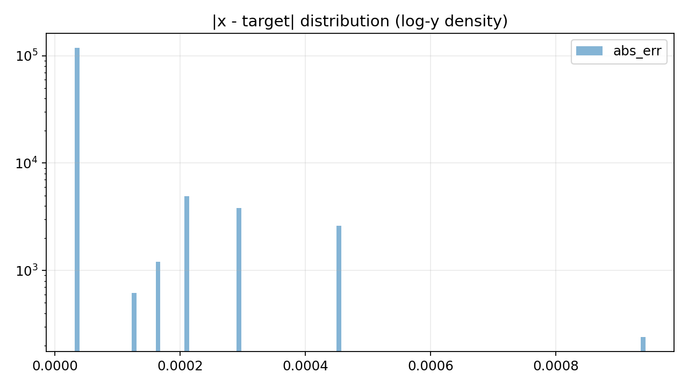

A good fit concentrates error near zero.
If error has a wide spread, the learned bounds may not be expressive enough for the target behavior.

### Figure D6 — Sorted profiles (target vs learned-final)

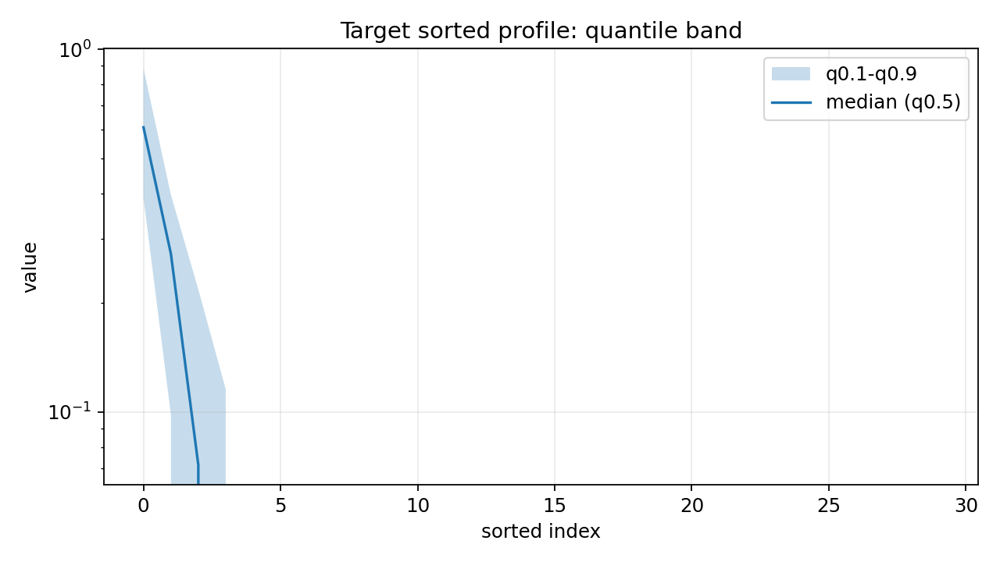


Interpretation:

- if the median curve matches closely and the quantile band overlaps, the learned configuration reproduces the target profile family
- differences at the head correspond to top-k behavior differences (mass concentration)

---

## 8. Use case E — Non-uniform $\gamma$ (“stiffness” / cost shaping)

### 8.1 Interpretation of $\gamma$

The objective is:

$$
\sum_i \gamma_i (x_i - z_i)^2.
$$

- larger $\gamma_i$: moving $x_i$ away from $z_i$ is more expensive (stiffer)
- smaller $\gamma_i$: coordinate is easier to move (absorbs more mass when satisfying the sum constraint)

This is a neat way to encode **heteroscedasticity** or **prior trust** in certain dimensions.

### Figure E1 — Mass distribution by coordinate group

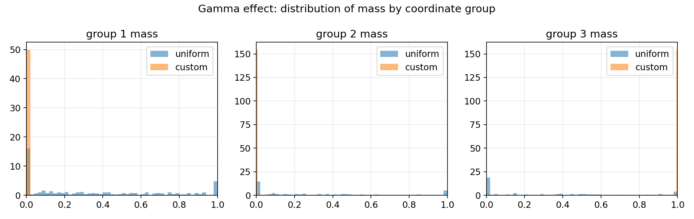

The plot splits coordinates into groups and compares total mass under:

- uniform $\gamma$
- custom $\gamma$

Expected: lower-$\gamma$ groups take more mass.

### Figure E2 — Support size (uniform $\gamma$)

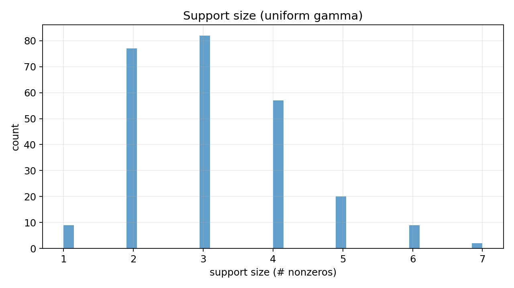

### Figure E3 — Support size (custom $\gamma$)

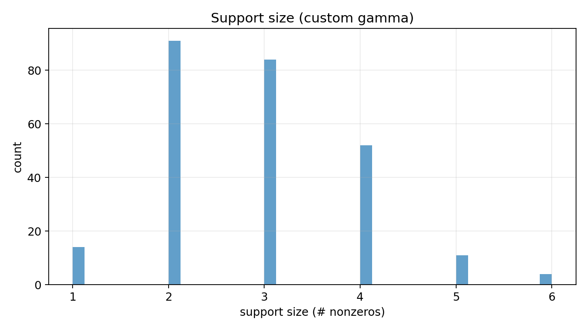

Support size can change with $\gamma$, because redistributing mass changes how many coordinates remain above zero after shifting/clipping.

---

## 9. Use case F — Solve from $\beta$ directly (predefined costs)

### 9.1 Setup

We can start from the original coefficients $\beta$ and compute

\[
z_i = -\frac{\beta_i}{2\gamma_i}.
\]

This is useful when:

- $\beta$ comes from a known cost function
- an upstream network predicts costs $\beta$ (and optionally curvatures $\gamma$)

### Figure F1 — Value histogram (log-y)

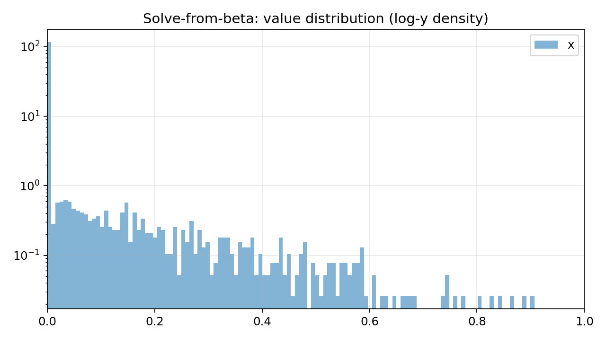

### Figure F2 — log10(value) histogram

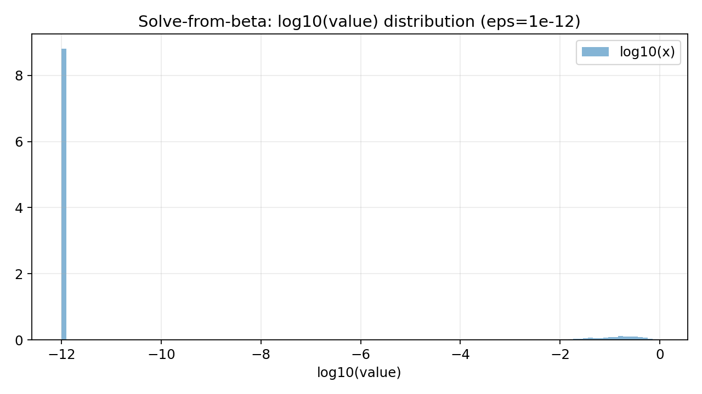

### Figure F3 — Fast vs high-iter error

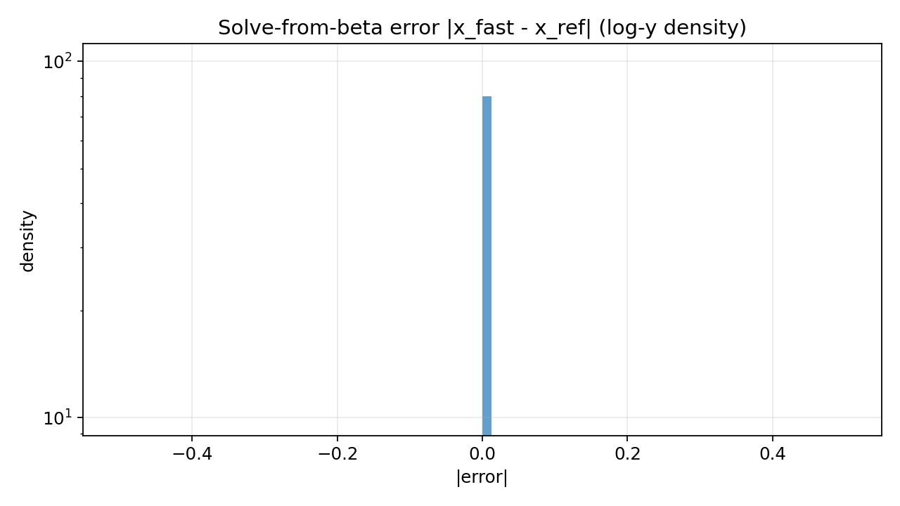

Interpretation: same as other “fast vs reference” plots.

---

## 10. Use case G — Fixed $z$ (deterministic constrained allocation)

If $z$ is constant, the solution $x^*$ is constant too.
This is useful for deterministic policies, priors, and calibration baselines.

### Figure G1 — Fixed-z value distribution (log-y)

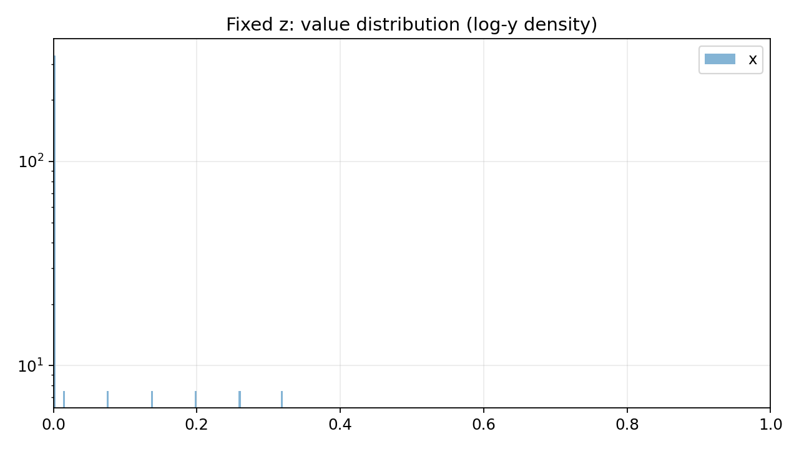

Because all rows are identical, you typically see a few spikes (discrete set of values).

### Figure G2 — Fixed-z sorted profile quantile band


The quantile band collapses to a thin region (often almost a single curve).

---

## 11. Geometry demo (N=2): contours + feasible set + solution

### Figure GEO — N=2 objective contours + feasible set segment + solution


How to read this plot:

- contour lines: level sets of the quadratic objective
- the feasible set: intersection of the line $x_1+x_2=\xi$ with the box $[m,M]^2$, i.e. a line segment
- the unconstrained minimizer $z$: where the quadratic is smallest without constraints
- the projected solution $x^*$: the closest feasible point to $z$ in the weighted metric

This is the geometric picture behind “projection layers.”

---

## 12. Troubleshooting: blank plots, missing images, and sanity checks

### 12.1 Some images don’t show up in your Markdown viewer

Most common causes:

1. **Wrong relative paths.**
   This report assumes it is **in the same folder** as the `.png` files.
2. **Filename mismatch.**
   The demo outputs have a `*_v2` naming convention (e.g. `simplex_hist_logy.png`).
   If you generated older plots, names may differ.
3. **IDE preview limitations.**
   Some IDE previews do not render images or math consistently.
   Try a browser-based renderer (GitHub, MkDocs, Jupyter, VS Code preview).

### 12.2 A histogram looks “blank”

Usually means the distribution is **highly concentrated**:

- all values are almost identical (delta spike), or
- all mass is at an edge (e.g. exactly 0 or exactly 1)

Fixes (plot-side):

- set x-limits from data: `xlim=(min(x)-δ, max(x)+δ)`
- add a “rug plot” (ticks) at sample points
- if values are near 1, use a tight window like `xlim=(0.95, 1.0)`

Interpretation (model-side):

- learning may have saturated a bound: e.g. $M_i \to 1$ for almost all i
- width $M_i-m_i$ may have collapsed for some dims (hard constraints)

### 12.3 If feasibility errors aren’t tiny

Increase bisection iterations and/or use float64 for debugging.
Feasibility should be extremely good because the constraint is enforced by construction.

### 12.4 If QP simplex doesn’t match the simplex reference

Check:

- are you in exactly $m=0$, $M=1$, $\xi=1$, $\gamma=1$?
- did the upper bound $x\le 1$ ever become active? (it usually shouldn’t for $\xi=1$)
- are you comparing the same `dtype` and tolerances?

The `simplex_error_vs_sort_ref.png` figure is designed specifically for this.

---

## Appendix — Expected output filenames

The demo script writes (at least) these figures:

- **Simplex vs softmax:**
  `simplex_hist_linear.png`, `simplex_hist_logy.png`, `simplex_hist_log10x.png`,
  `simplex_sorted_profiles_softmax_quantiles.png`, `simplex_sorted_profiles_qp_quantiles.png`,
  `simplex_support_size_qp.png`, `simplex_topk_mass_qp.png`, `simplex_topk_mass_softmax.png`,
  `simplex_error_vs_high_iter.png`, `simplex_error_vs_sort_ref.png`, `simplex_piecewise_with_freecount.png`
- **k-hot / budget gating:**
  `khot_hist_logy.png`, `khot_hist_log10x.png`, `khot_support_size.png`, `khot_topk_mass.png`,
  `khot_sorted_profiles_quantiles.png`, `khot_error_vs_high_iter.png`
- **Adaptive $\xi$:**
  `adaptive_xi_curve.png`, `adaptive_xi_value_hist_logy.png`
- **Learnable bounds:**
  `learned_bounds_m_compare.png`, `learned_bounds_M_compare.png`, `learned_bounds_width_compare_logy.png`,
  `learn_bounds_loss_curve_logy.png`, `learn_bounds_abs_error_logy.png`,
  `learn_bounds_sorted_profiles_target.png`, `learn_bounds_sorted_profiles_final.png`
- **Gamma effects:**
  `gamma_group_mass_compare.png`, `gamma_support_size_uniform.png`, `gamma_support_size_custom.png`
- **Solve-from-beta:**
  `solve_from_beta_hist_logy.png`, `solve_from_beta_hist_log10x.png`, `solve_from_beta_error_vs_high_iter.png`
- **Fixed $z$:**
  `fixed_z_hist_logy.png`, `fixed_z_sorted_profiles_quantiles.png`
- **Geometry:**
  `contour_n2_geometry.png`
